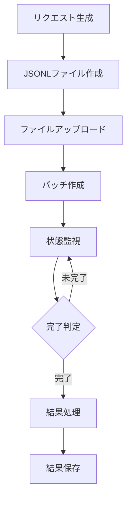
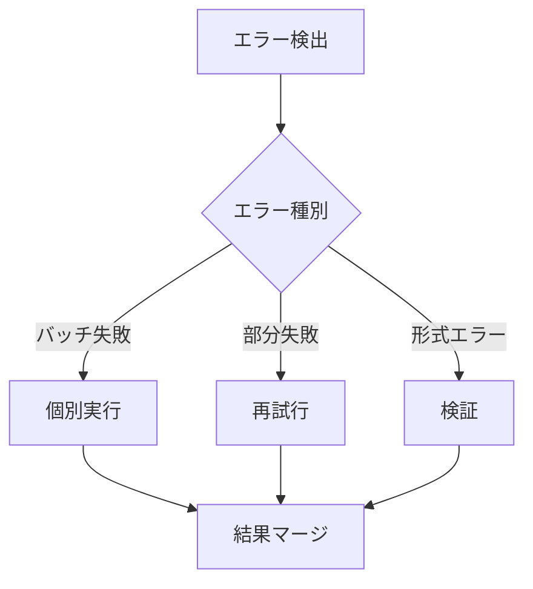

# バッチAPI処理パターン

## コスト最適化パターン

### 1. プロバイダー別バッチ処理
- OpenAI: JSONL処理（50%コスト削減）
  - 24時間以内の処理保証
  - 最大50,000リクエスト/バッチ
  - 200MBファイルサイズ制限

- Claude: Message Batches API（予定）
  - 100件/分のスロットリング
  - リクエストのバンドル化

- Gemini: Vertex AI Batch（予定）
  - 非同期処理サポート
  - スケーラブルな実行

### 2. バッチ処理フロー


## エラーハンドリングパターン

### 1. 階層的エラー処理
- バッチレベル：処理全体の失敗
- リクエストレベル：個別リクエストの失敗
- レスポンスレベル：データ形式エラー

### 2. リカバリーパターン


## バックアップパターン

### 1. タイムスタンプベース
```
results/
└── {provider}/
    └── backup/
        └── YYYYMMDD_HHMMSS/
            ├── batch_inputs/
            ├── batch_results/
            └── batch_errors/
```

### 2. 自動バックアップタイミング
- バッチ処理開始時
- エラー発生時
- 定期的なスナップショット

## 監視パターン

### 1. 進捗モニタリング
- リクエスト数の追跡
- 完了率の計算
- エラー率の監視

### 2. メトリクス
```
completed_rate = completed / total
error_rate = failed / total
progress = current_time - start_time
remaining = estimated_completion - current_time
