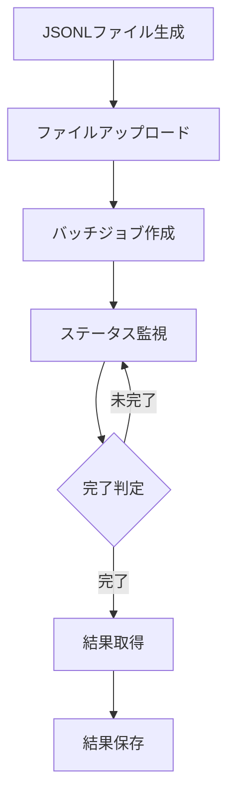

# Batch Processing Patterns

## Provider-Specific Implementations

### OpenAI (実装済み: 2025-03-22)
- エンドポイント: `/v1/chat/completions`
- 形式: JSONLバッチリクエスト
- コスト削減: 50%
- 処理時間: 24時間以内
- 制限:
  - 最大50,000リクエスト/バッチ
  - ファイルサイズ上限: 200MB

#### 実装パターン


#### ファイルフォーマット
1. リクエストファイル（JSONL）:
```json
{
  "custom_id": "p{persona}_{text}_n{trial}",
  "method": "POST",
  "url": "/v1/chat/completions",
  "body": {
    "model": "モデル名",
    "temperature": 温度値,
    "messages": [
      {"role": "system", "content": "システムメッセージ"},
      {"role": "user", "content": "ユーザーメッセージ"}
    ]
  }
}
```

2. 結果ファイル（JSON）:
```json
{
  "id": "バッチリクエストID",
  "custom_id": "リクエスト識別子",
  "response": {
    "status_code": HTTPステータスコード,
    "request_id": "OpenAIリクエストID",
    "body": {
      "choices": [
        {
          "message": {
            "content": "レスポンス内容",
            "role": "assistant"
          }
        }
      ]
    }
  }
}
```

#### エラーハンドリング
- バッチ作成エラー: ファイル形式、サイズ制限
- 処理タイムアウト: 24時間制限
- モデル制限: トークン数、レート制限
- ネットワークエラー: 再試行とバックオフ

### Claude (Anthropic)
- Feature: Message Batches API
- Cost Reduction: 50%
- Window: 24 hours
- Status: Polling-based tracking
- Results: Available for 29 days

### Gemini (Google)（2025-04-11更新）
#### 基本情報
- Service: Vertex AI Batch Prediction
- Cost Reduction: 50%
- Input Sources: Cloud Storage, BigQuery
- Output Destinations: Cloud Storage, BigQuery
- Region: Must match service region

#### プロンプト制御
```python
def create_enhanced_prompt(system_msg, user_msg):
    """強化されたプロンプトの生成"""
    return {
        "contents": [
            {"role": "user", "parts": [{"text": f"""
{system_msg}

重要：必ず以下の形式で回答してください。各項目の数値を必ず記入してください。

{user_msg}

注意：
- 必ず数値を[0-100]の範囲で明示的に記入してください
- 各項目の(数値)と(理由)を明確に分けて記述してください
- 形式は厳密に守ってください
"""}]}
        ],
        "generation_config": {
            "temperature": calculated_temperature
        }
    }
```

#### パターンマッチング処理
```python
def process_batch_responses(responses):
    """バッチ応答の処理"""
    results = []
    for response in responses:
        validated = validate_response(response)
        if not validated:
            response = retry_response(response)
        
        result = {
            "values": extract_all_values(response),
            "reasons": extract_all_reasons(response),
            "metadata": {
                "temperature": response.temperature,
                "validation_status": "success" if validated else "retry_success"
            }
        }
        results.append(result)
    return results
```

#### 品質管理
```python
def validate_batch_results(results):
    """バッチ結果の検証"""
    validation_stats = {
        "total": len(results),
        "success": 0,
        "retry_success": 0,
        "failed": 0,
        "pattern_match_stats": defaultdict(int)
    }
    
    for result in results:
        if result["metadata"]["validation_status"] == "success":
            validation_stats["success"] += 1
        elif result["metadata"]["validation_status"] == "retry_success":
            validation_stats["retry_success"] += 1
        else:
            validation_stats["failed"] += 1
        
        # パターンマッチング統計
        for field, pattern in result["metadata"].get("matched_patterns", {}).items():
            validation_stats["pattern_match_stats"][pattern] += 1
    
    return validation_stats
```

### Groq
- Feature: Batch API
- Cost Reduction: 25%
- Format: JSONL files
- Size Limit: 50,000 lines or 200MB
- Window: 24 hours to 7 days

### kluster.ai
- Feature: Adaptive Inference Batch API
- Compatible: OpenAI-style interface
- Format: JSONL for bulk processing
- Models: DeepSeek, Llama support
- Processing: Asynchronous with completion tracking

## Common Implementation Patterns
### Data Format
- JSONL standard for batch requests
- Consistent structure across providers
- Unique request identifiers
- Error handling metadata

### Processing Control
- Provider-specific batch size limits
- Optimal processing windows
- Automatic retries on failures
- Progress monitoring
- Result aggregation

### Error Handling
- Detailed error logging
- Automatic retry logic
- Partial success handling
- Result validation

### Cost Optimization
- Provider-specific cost reductions
- Batch size optimization
- Processing window optimization
- Error minimization strategies

## Usage Guidelines
1. Choose appropriate batch sizes
2. Set optimal processing windows
3. Implement proper error handling
4. Monitor processing status
5. Validate results
6. Handle partial success cases
7. Maintain proper logging
