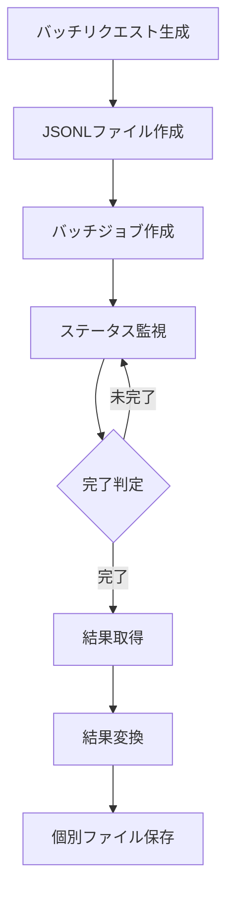
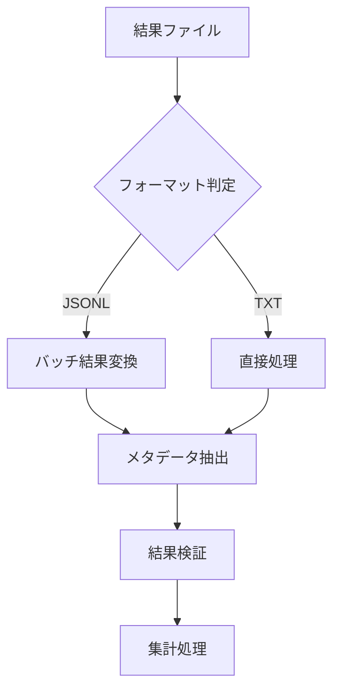
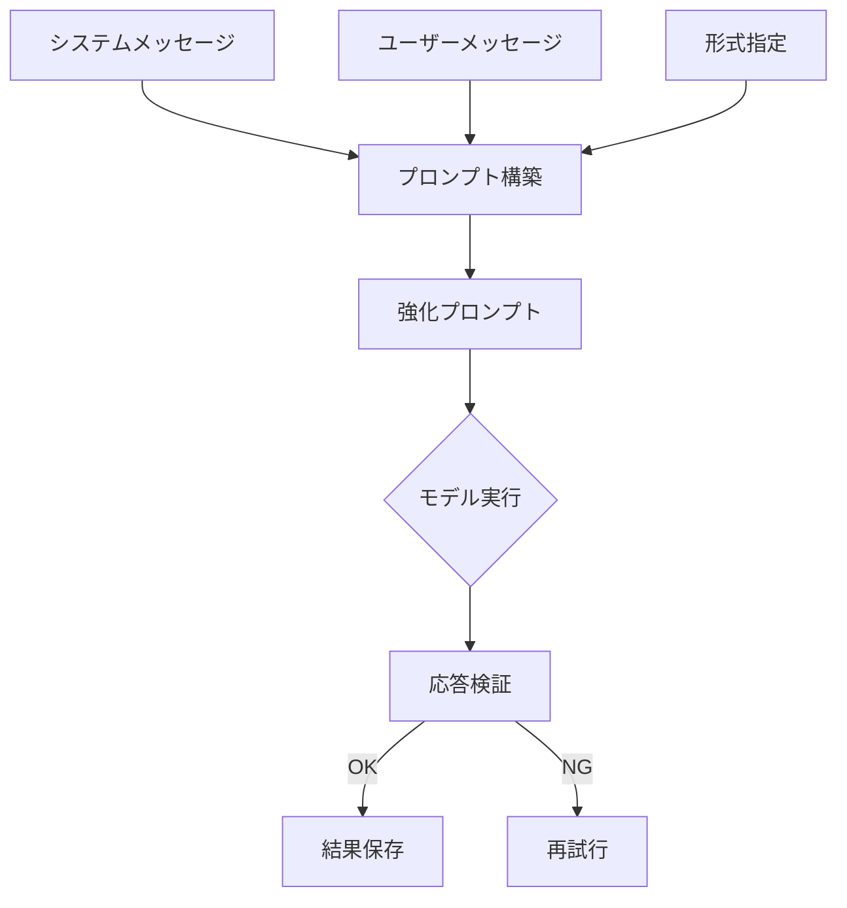

# システムパターン

## アーキテクチャパターン

### バッチ処理システム


1. リクエスト生成
   - モデル固有のフォーマット適用
   - パラメータ検証
   - カスタムID生成

2. バッチ処理
   - JSONLフォーマット使用
   - 非同期処理
   - ステータス管理

3. 結果処理（2025-03-27更新）
   - JSONLからテキストへの変換
   - Unicodeエスケープ解決
   - temperature: None対応
   - メタデータの標準化

### 結果管理システム


1. ファイル構造
   - モデル別ディレクトリ
   - 標準化されたファイル名
   - メタデータ形式

2. データフロー
   - バッチ結果の変換
   - メタデータの抽出
   - 結果の検証
   - 集計処理

## 実装パターン

### バッチ処理
1. リクエスト生成
```python
def create_batch_request(model_type, requests):
    if model_type == "openai":
        return create_openai_batch(requests)
    elif model_type == "claude":
        return create_claude_batch(requests)
    elif model_type == "klusterai":
        return create_klusterai_batch(requests)
```

2. 結果変換（2025-03-27更新）
```python
def convert_batch_results(input_file):
    """Convert batch results from JSONL to individual text files."""
    with open(input_file, 'r') as f:
        for line in f:
            data = json.loads(line)
            # Extract metadata
            metadata = extract_metadata(data)
            # Handle temperature
            if is_reasoning_model(metadata['model']):
                metadata['temperature'] = None
            # Convert and save
            save_result_file(metadata, data['content'])
```

### エラーハンドリング
1. バッチ処理エラー
```python
def handle_batch_error(batch_id, error):
    if is_partial_success(error):
        save_partial_results(batch_id)
        retry_failed_requests(batch_id)
    else:
        handle_complete_failure(batch_id)
```

2. 変換エラー
```python
def handle_conversion_error(file_id, error):
    log_error(file_id, error)
    if is_recoverable(error):
        retry_conversion(file_id)
    else:
        mark_as_failed(file_id)
```

## データパターン

### メタデータ形式
```python
metadata = {
    'timestamp': 'YYYY-MM-DD HH:MM:SS',
    'persona': 'p1-p4',
    'model': 'model_name',
    'trial': 'n01-n10',
    'temperature': float or None,  # 2025-03-27: None for reasoning models
    'text': 't1-t3'
}
```

### 結果フォーマット
```
timestamp: [timestamp]
persona: [persona_id]
model: [model_id]
trial: [trial_number]
temperature: [value or None]
text: [text_id]

Q1value: [0-100]
Q1reason: [explanation]
...
Q4value: [0-100]
Q4reason: [explanation]
```

## モニタリングパターン

### バッチ処理監視
1. ステータスチェック
```python
def check_batch_status(batch_id):
    status = get_batch_status(batch_id)
    if status.is_complete:
        process_results(batch_id)
    elif status.has_error:
        handle_batch_error(batch_id)
    else:
        schedule_next_check(batch_id)
```

2. エラー追跡
```python
def track_errors(batch_id):
    errors = collect_errors(batch_id)
    log_errors(errors)
    notify_if_critical(errors)
    update_error_stats(errors)
```

## 拡張パターン

### プロンプト制御パターン（2025-04-11追加）


1. プロンプト強化実装
```python
def create_enhanced_prompt(system_msg, user_msg):
    """プロンプトの強化と構造化"""
    return f"""
{system_msg}

重要：必ず以下の形式で回答してください。各項目の数値を必ず記入してください。

{user_msg}

注意：
- 必ず数値を[0-100]の範囲で明示的に記入してください
- 各項目の(数値)と(理由)を明確に分けて記述してください
- 形式は厳密に守ってください
"""
```

2. メッセージ分離パターン
```python
def separate_messages(prompt):
    """システムメッセージとユーザーメッセージの分離"""
    return {
        "messages": [
            {"role": "system", "content": prompt.system},
            {"role": "user", "content": prompt.user}
        ]
    }
```

### 応答抽出パターン（2025-04-11追加）
1. 柔軟なパターンマッチング
```python
def create_patterns(question):
    """複数のパターンマッチング形式を定義"""
    return [
        rf"Q\d+\.\s*{question}\(数値\):\s*(\d+)",  # 標準形式
        rf"Q\d+\.\s*{question}:\s*\(数値\):\s*(\d+)",  # 代替形式1
        rf"Q\d+\.\s*{question}\s*数値:\s*(\d+)",  # 代替形式2
        rf"Q\d+\.\s*{question}:\s*(\d+)",  # シンプル形式
        rf"{question}(?:の評価)?(?:\s*[:：]\s*|\s+)(\d+)",  # 日本語形式1
        rf"{question}(?:度|レベル)(?:\s*[:：]\s*|\s+)(\d+)",  # 日本語形式2
        rf"「{question}」\s*[:：]?\s*(\d+)",  # 括弧形式
        rf"\[{question}\]\s*[:：]?\s*(\d+)"  # 角括弧形式
    ]
```

2. 段階的マッチング処理
```python
def extract_value(text, question):
    """段階的なパターンマッチングの適用"""
    patterns = create_patterns(question)
    for pattern in patterns:
        if match := re.search(pattern, text, re.MULTILINE):
            return match.group(1)
    return ""
```

### 品質保証パターン（2025-04-11追加）
1. 応答検証
```python
def validate_response(response):
    """応答の品質検証"""
    required_fields = ["面白さ", "驚き", "悲しみ", "怒り"]
    for field in required_fields:
        value = extract_value(response, field)
        if not value or not (0 <= int(value) <= 100):
            return False
    return True
```

2. エラー回復
```python
def handle_invalid_response(model, prompt, max_retries=3):
    """無効な応答のリカバリー"""
    for attempt in range(max_retries):
        response = model.generate_content(prompt)
        if validate_response(response):
            return response
    raise ValidationError("Maximum retries exceeded")
```

### 新規モデル追加
1. バッチ処理サポート
```python
def add_model_support(model_config):
    register_batch_handler(model_config)
    register_result_converter(model_config)
    update_monitoring(model_config)
```

2. 結果変換サポート
```python
def add_converter_support(model_config):
    register_metadata_handler(model_config)
    register_content_converter(model_config)
    register_validation_rules(model_config)
```
