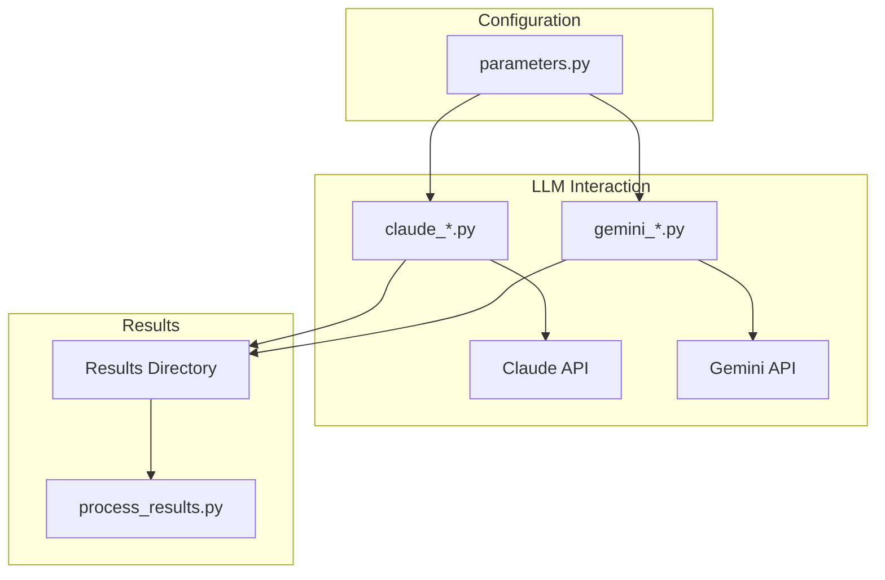

# System Patterns

## Architecture

The project follows a modular architecture, with separate scripts for interacting with each LLM (Claude and Gemini). The `parameters.py` file manages shared configurations.

## Design Patterns

- **Strategy Pattern:** Used to switch between different LLM models (Claude and Gemini).
- **Factory Pattern:** Used to create different LLM clients based on the model name.
- **Observer Pattern:** Used in result processing and analysis.

## Component Relationships



## File Organization

### Results Structure
```
project/
├── results_gemini/       # Current experimental results
│   └── p{persona}_t{text}_{model}_n{trial}_temp{temp}.txt
├── 01_results_gemini/    # Versioned results
│   └── p{persona}_t{text}_{model}_n{trial}_temp{temp}.txt
```

### Naming Convention
- `p{persona}`: Persona identifier (1-4)
- `t{text}`: Text identifier (1-3)
- `{model}`: Model identifier (e.g., gemini15f, gemma30)
- `n{trial}`: Trial number (e.g., 01)
- `temp{temp}`: Temperature setting (e.g., 50 for 0.5)
