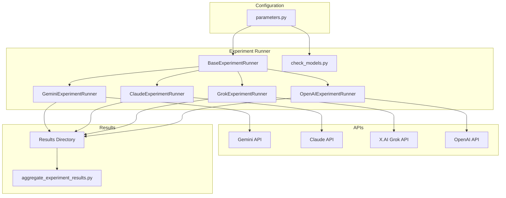

# System Patterns

## Architecture

The project follows a modular architecture, with a unified experiment runner that supports multiple LLMs (Gemini, Claude, Grok, OpenAI). The `parameters.py` file manages shared configurations and model-specific settings.

## Design Patterns

- **Strategy Pattern:** Used to switch between different LLM models and handle model-specific behaviors.
- **Factory Pattern:** Used to create different LLM clients based on the model type.
- **Observer Pattern:** Used in result processing and analysis.
- **Template Method Pattern:** Used in BaseExperimentRunner for defining the common experiment structure.

## Component Relationships



## File Organization

### Results Structure
```
project/
├── results/
│   ├── gemini/          # Gemini experiment results
│   │   └── p{persona}_{model}_n{trial}_temp{temp}_t{text}.txt
│   ├── claude/          # Claude experiment results
│   │   └── p{persona}_{model}_n{trial}_temp{temp}_t{text}.txt
│   ├── grok/            # Grok experiment results
│   │   └── p{persona}_{model}_n{trial}_temp{temp}_t{text}.txt
│   └── openai/          # OpenAI experiment results
│       └── p{persona}_{model}_n{trial}[_temp{temp}]_t{text}.txt
```

Note: OpenAIのreasoningモデルの場合は temperature パラメータを使用しないため、ファイル名から _temp{temp} が省略されます。

### Naming Convention
- `p{persona}`: Persona identifier (1-4) e.g., p1, p2
- `{model}`: Model identifier (e.g., gemini15f, claude30s)
- `n{trial}`: Trial number (e.g., n01)
- `temp{temp}`: Temperature setting (e.g., temp50 for 0.5)
- `t{text}`: Text identifier (1-3) e.g., t1, t2

### Model Naming Examples
- Gemini: gemini15f (1.5 Flash), gemini20pe (2.0 Pro Exp)
- Claude: claude37s (3.7 Sonnet), claude30h (3.0 Haiku)
- Grok: grok20l (2.0 Latest)
- OpenAI: gpt4o (GPT-4), o3mini (O3 Mini, reasoning type)
